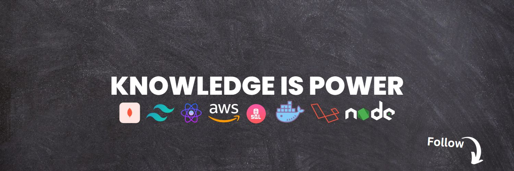

<h1 align='center'>👋Greetings! I'm Iftekhar Ahmad</h1>

A Raw Programming is what i do as i love building customized Web application. In this era of SAAS ruling the Digital Industry i believe as a full-stack web developer my skillset will help building impactful software products.

#### - 🔭 I’m currently working on **[Wave](https://github.com/iftekhs/wave)**

####

#### - 🌱 I’m currently learning **Typescript, Redux, React Native**

####

#### - 👯 I’m looking to collaborate on **React or MERN projects.**

####

#### - 🤝 I’m looking for help with **AWS**

####

#### - 💬 Ask me about **Anything**

####

#### - 📫 How to reach me **hello@iftekharahmad.com**

####

#### - 📄 Know about my experiences [View My Resume](https://drive.google.com/file/d/1sfsB0hi5xcpZfHG2FY1L5wtlfTO3LTPw/view?usp=sharing)

####

#### - ⚡ Fun fact **Creating projects constantly!**

<!-- 
  
 -->

## :computer: Technologies that I know

  
  
  
  
  
  
  
  
  
  
  
  
  
  
  
  
  
  
  
  

## :mailbox: Reach me out

  
  

## :chart_with_upwards_trend: Current Stats

  

  
  

<!-- 

# 

-->

